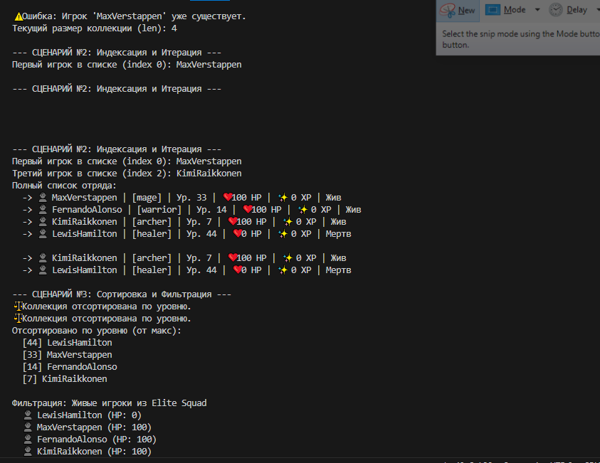

#  Лабораторная работа №2: Коллекция объектов
### **Вариант №6: Игровая логика (Game Logic) — Контейнеры**

##  Цель работы
Изучение принципов работы с контейнерными классами в Python:
*   Разделение ответственности между **сущностью** (Entity) и **коллекцией** (Container).
*   Реализация методов управления группой объектов (`add`, `remove`, `find`).
*   Освоение итерации и индексации через магические методы.
*   Реализация логической фильтрации и сортировки объектов.

---

##  Демонстрация работы (Скриншоты)

### 1. Выполнение сценариев в терминале
На скриншоте ниже показана работа `demo.py`: создание объектов, добавление в коллекцию, проверка дубликатов, индексация и итоговая фильтрация живых персонажей.

### 2. Структура проекта
Организация файлов согласно требованиям лабораторной работы в директории `src/lab02`.

---

##  Ответы на контрольные вопросы (Теория)

### **Вопрос 1. В чем разница между моделью и контейнером?**
**Ответ:** 
*   **Модель (`Player`):** Это класс-сущность, который описывает структуру и поведение одного конкретного объекта (одного игрока). Он хранит индивидуальные данные: имя, уровень, здоровье.
*   **Контейнер (`PlayerCollection`):** Это класс-менеджер, который отвечает за управление множеством объектов. Он инкапсулирует логику хранения списка, поиска по критериям, массовой фильтрации и сортировки всей группы.

### **Вопрос 2. Зачем проверять тип добавляемого объекта (isinstance)?**
**Ответ:** Проверка типа необходима для обеспечения **целостности данных** внутри коллекции. Это гарантирует, что в список не попадут посторонние типы данных (строки, числа), которые могут вызвать ошибки при выполнении операций сортировки (по уровню) или фильтрации (по здоровью), так как эти методы ожидают наличие определенных атрибутов у объектов.

### **Вопрос 3. Какова роль магических методов в коллекции?**
*   `__len__`: Позволяет использовать стандартную функцию `len(collection)` для получения текущего размера списка игроков.
*   `__iter__`: Позволяет сделать объект коллекции перебираемым, чтобы использовать его в циклах `for player in collection`.
*   `__getitem__`: Позволяет реализовать индексацию, чтобы обращаться к конкретному игроку по его номеру в списке, например `collection[0]`.

---

##  Реализованные сценарии (в demo.py)
1.  **Сценарий №1 (Управление):** Создание сущностей `Player`, добавление их в `PlayerCollection` и автоматическая блокировка дубликатов по никнейму.
2.  **Сценарий №2 (Доступ):** Использование методов `__len__`, `__getitem__` и `__iter__` для удобного доступа к данным коллекции.
3.  **Сценарий №3 (Логика):** Сортировка отряда по уровню (от высшего к низшему) и фильтрация живых игроков с возвратом **нового объекта** коллекции.

---
**Разработчик:** Lodaneo Nkoko Mnauel
