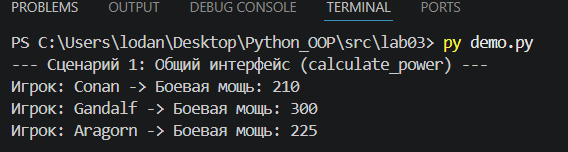
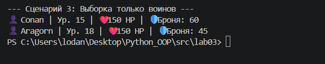
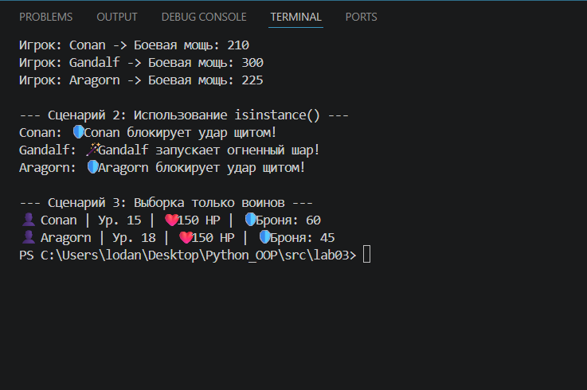

# Лабораторная работа №3: Наследование и иерархия классов

## 1. Цель работы
Освоить механизм наследования классов, научиться строить иерархию объектов (базовый и производные классы), изучить переиспользование кода и принципы полиморфизма в объектно-ориентированном программировании на Python.

---

## 2. Описание реализованной иерархии классов

В рамках данной работы была спроектирована иерархия классов для игровой логики:

*   **Базовый класс `Player` (base.py):** Содержит общие атрибуты (нинкнейм, уровень, здоровье) и базовый метод `calculate_power()`, который служит общим интерфейсом для всех существ.
*   **Производный класс `Warrior` (models.py):** Специализация "Воин". Добавлены атрибуты `armor` (броня) и `strength` (сила). Метод расчета мощности переопределен с учетом показателей защиты.
*   **Производный класс `Mage` (models.py):** Специализация "Маг". Добавлены атрибуты `mana` (мана) и `intelligence` (интеллект). Расчет мощности зависит от магического потенциала.

**Различия:** Классы различаются формулами расчета боевой мощи (`calculate_power`) и уникальными методами взаимодействия (`use_shield` против `cast_spell`).

---

## 3. Демонстрация работы
Сценарии работы реализованы в файле `demo.py`:

1.  **Сценарий №1 (Полиморфизм):** Создание списка объектов разных типов и вызов единого метода `calculate_power()`. Каждый объект выполняет свою реализацию метода без проверки условий (if/type).

2.  **Сценарий №2 (Проверка типов):** Использование `isinstance()` для безопасного вызова специфических методов дочерних классов (блокировка щитом для воинов, заклинания для магов).

3.  **Сценарий №3 (Работа с коллекцией):** Интеграция с контейнером из ЛР-2. Демонстрация фильтрации общей коллекции для получения списка только определенных объектов (например, только воинов).

**Скриншот работы сценариев:**

---

## 4. Вывод
В ходе выполнения лабораторной работы были изучены:
*   **Наследование:** Механизм передачи атрибутов и методов от родительского класса к дочерним с помощью `super()`.
*   **Полиморфизм:** Возможность использовать объекты разных классов через единый интерфейс, что делает код более гибким и масштабируемым.
*   **Иерархия объектов:** Понимание того, как структурировать код для исключения дублирования логики при создании специализированных сущностей.
