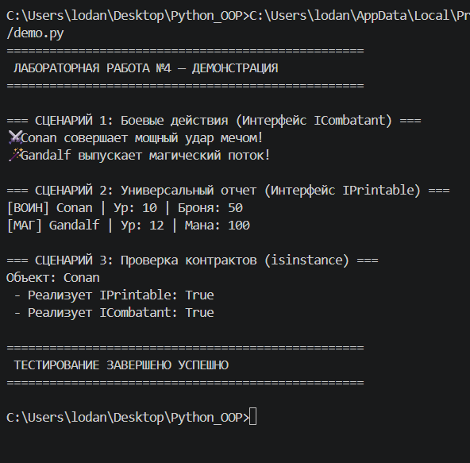

# Лабораторная работа №4: Интерфейсы и абстрактные классы (ABC)

## 1. Цель работы
Изучение и практическое применение механизмов абстракции в Python. Основное внимание уделено созданию **абстрактных базовых классов (ABC)** и проектированию систем на основе **интерфейсов** (контрактов поведения), что позволяет закрепить принципы полиморфизма и построения гибкой архитектуры приложений.

---

## 2. Описание интерфейсов
В работе спроектированы два ключевых интерфейса (в файле `interfaces.py`), которые задают обязательные стандарты поведения для игровых сущностей:

1.  **`IPrintable`**:
    *   **Требуемый метод:** `to_string()`.
    *   **Назначение:** Обязывает объект возвращать стандартизированное текстовое описание своей текущей конфигурации.
2.  **`ICombatant`**:
    *   **Требуемый метод:** `execute_action()`.
    *   **Назначение:** Гарантирует наличие базового игрового действия (атаки или заклинания) для всех боевых единиц.

---

## 3. Реализация в классах
Интерфейсы реализованы в классах `Warrior` и `Mage` (в файле `models.py`) с использованием множественного наследования:

*   **Класс `Warrior` (Воин):**
    *   **Реализация:** Наследует `Player`, `IPrintable` и `ICombatant`.
    *   **Поведение:** Метод `to_string()` выводит данные о броне, а `execute_action()` имитирует физическую атаку мечом.
*   **Класс `Mage` (Маг):**
    *   **Реализация:** Наследует `Player`, `IPrintable` и `ICombatant`.
    *   **Поведение:** Метод `to_string()` выводит данные о магической энергии (мане), а `execute_action()` имитирует применение заклинания.

**Различие:** Благодаря интерфейсам, объекты разных типов могут обрабатываться единообразно, несмотря на абсолютно разную внутреннюю логику их действий.

---

## 4. Демонстрация работы
Сценарии в файле `demo.py` демонстрируют работу системы на оценку 5.0:

1.  **Сценарий №1 (Полиморфизм интерфейса):** Вызов метода `execute_action()` для всех объектов коллекции, реализующих интерфейс `ICombatant`. Выполняется без использования условных операторов `if`.

2.  **Сценарий №2 (Универсальная функция):** Работа функции `display_info`, которая принимает список объектов типа `IPrintable`. Это демонстрирует использование интерфейса как типа данных.

3.  **Сценарий №3 (Фильтрация по интерфейсу):** Использование метода `get_by_interface()` в коллекции для автоматической выборки только тех объектов, которые подписали определенный "контракт" поведения.

**Скриншот работы сценариев:**

