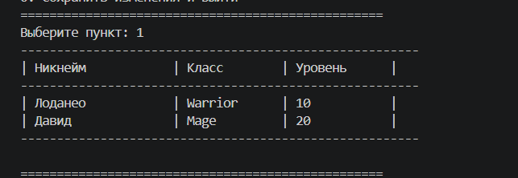
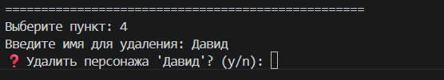
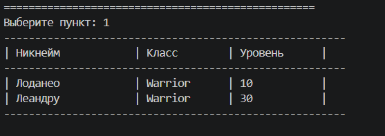
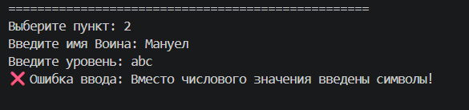
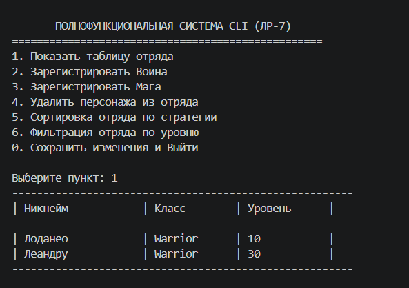

# Лабораторная работа №7: Разработка интерактивного консольного приложения (CLI)

## 1. Цель работы
Объединить все архитектурные паттерны, навыки объектно-ориентированного проектирования, принципы функционального программирования и статической типизации (из ЛР-1 — ЛР-6) в единую многослойную систему. Разработать интерактивное CLI-приложение, устойчивое к ошибкам ввода, с поддержкой долговременного хранения данных.

---

## 2. Структура проекта
Приложение спроектировано по принципу разделения ответственности и разделено на следующие независимые слои:

*   **`main.py`** — Точка входа в систему. Инициализирует и запускает интерактивный цикл пользовательского интерфейса.
*   **`cli.py` (Слой представления)** — Отвечает исключительно за консольный ввод/вывод (`input()` и `print()`), рендеринг текстового меню, сбор данных и перехват пользовательских ошибок. Не содержит бизнес-логики.
*   **`app.py` (Слой бизнес-логики)** — Сердце системы. Управляет объектами сущностей (`Warrior`, `Mage`), координирует работу коллекции, производит полиморфный расчет боевой мощи и вызывает методы сохранения.
*   **`storage.py` (Слой данных)** — Отвечает за персистентность. Переводит внутренние объекты в формат JSON и восстанавливает их состояние при перезапуске системы.
*   **`exceptions.py` (Обработка ошибок)** — Содержит кастомную иерархию классов ошибок предметной области приложения.

---

## 3. Описание CLI

### Реализованные пункты меню:
1.  **Показать таблицу отряда** — Вывод всех персонажей в виде отформатированной таблицы.
2.  **Зарегистрировать Воина** — Создание объекта `Warrior` с указанием уровня и брони.
3.  **Зарегистрировать Мага** — Создание объекта `Mage` с указанием уровня и маны.
4.  **Удалить персонажа из отряда** — Интерактивное удаление по никнейму с обязательным подтверждением опасной операции.
5.  **Сортировка отряда по стратегии** — Подменю для выбора алгоритма сортировки (по алфавиту, уровню или боевой мощи).
6.  **Фильтрация отряда по уровню** — Выборка персонажей, чей уровень выше или равен заданному значению.
0.  **Сохранить изменения и Выйти** — Запись данных на диск и корректное завершение процесса.

### Обработка ошибок ввода:
Вся система защищена от падений при некорректном поведении пользователя (ввод букв вместо чисел, пустые строки, неверные пункты меню) с помощью блоков `try/except`. При возникновении `ValueError` или бизнес-исключений из `exceptions.py` интерфейс выводит понятное предупреждение в консоль и безопасно восстанавливает цикл меню.

### Работа сохранения и загрузки (Оценка 5.0):
Долговременная память реализована через автоматическую JSON-сериализацию. При старте `main.py` контроллер обращается к `storage.py`, считывает файл `game_data.json` и автоматически воссоздает объекты классов `Warrior` и `Mage`. При выборе пункта `0` коллекция преобразуется в список словарей и перезаписывает файл.

---

## 4. Демонстрация работы

### Описание сценариев:
*   **Сценарий 1 (Автозагрузка):** Запуск программы и автоматическое считывание сохраненных персонажей из файла JSON с последующим выводом отформатированной таблицы.

*   **Сценарий 2 (Подтверждение и сохранение):** Попытка удаления персонажа, вызов prompt-запроса `❓ (y/n)` для подтверждения операции, выход и повторный запуск для демонстрации сохранности изменений.

*   **Сценарий 3 (Стратегии сортировки):** Выбор подменю сортировки, применение динамических `lambda`-стратегий расчета боевой мощи к коллекции.

*   **Сценарий 4 (Валидация):** Ввод некорректных символов в числовые поля (уровень/броня) и демонстрация перехвата кастомных исключений без падения CLI.

**Скриншоты терминала:**

---

## 5. Вывод
В ходе выполнения финальной лабораторной работы были изучены:
*   **Разбиение на модули и слои:** Практическое освоение многослойной архитектуры (Layered Architecture), обеспечивающей полную независимость интерфейса (CLI) от бизнес-логики и работы с файлами.
*   **CLI-интерфейс:** Понимание принципов построения диалоговых программ и организации интерактивных меню.
*   **Обработка исключений:** Создание иерархии собственных ошибок для разграничения системных сбоев языка от логических ошибок пользователя.
*   **Работа с файлами и типизация (Оценка 5.0):** Закрепление навыков сериализации сложных объектов в формат JSON и применение строгой статической аннотации типов (`PEP 484`) для обеспечения масштабируемости, читаемости и простоты поддержки архитектуры проекта.
